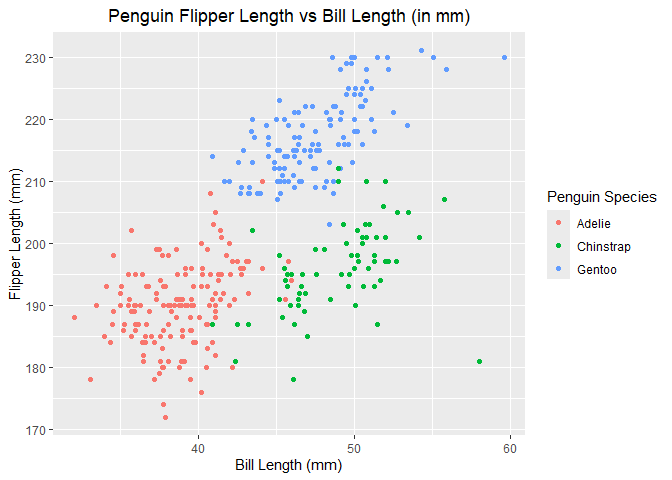

HW1
================

## Problem 1

***Penguin Dataset Description***

The penguins dataset is described by **8** variables, which are:
**species, island, bill_length_mm, bill_depth_mm, flipper_length_mm,
body_mass_g, sex, year**. This dataset is **344** rows by **8** columns.
The average flipper length of the penguins in this dataset is
**200.9152047** mm.

***Penguin Dataset Scatter Plot***

Below is the scatter plot of the penguin flipper length against the
penguin bill length. They are sorted by species and lengths are in mm:

<!-- -->

## Problem 2

Below is the code chunk to create a data frame (named question2_df) that
contains numeric, logical, character, and factor vectors:

``` r
question2_df = tibble(
vector_num = rnorm(10),
vector_logical = vector_num > 0,
vector_char = c("this", "is", "a", "character", "vector", "with", "the", "length", "of", "ten"),
vector_factor = factor(c("undergrad","PhD","masters","PhD","undergrad","undergrad","masters","PhD","PhD","undergrad"))
)
```

When trying to take the means of these vectors, we get errors for the
character and factor vectors:

    ## Warning in mean.default(pull(question2_df, vector_char)): argument is not
    ## numeric or logical: returning NA

    ## Warning in mean.default(pull(question2_df, vector_factor)): argument is not
    ## numeric or logical: returning NA

To try and circumvent this error, we can try to convert the vectors to
numeric using as.numeric():

``` r
logi_to_num = as.numeric(pull(question2_df,vector_logical))
char_to_num = as.numeric(pull(question2_df,vector_char))
fact_to_num = as.numeric(pull(question2_df,vector_factor))
```

The logical and factor vectors are able to convert to numeric, but the
character vector gives the warning: **NAs introduced by coercion**. It
makes sense for the logical vector to have the ability to convert to
numeric, as there are only two values (true and false) that can be
assigned a numeric value (1 and 0, respectively). For the same reason,
factor vectors are able to convert to numeric by assigning a number to
each of its levels. However, character vectors don’t necessarily have a
“pattern” the way the other vector types do, which is why it can’t be
converted to a numeric vector.

This lines up with what we have seen when trying to take the mean of
these vector types: logical vectors have an average because it will
always assign 0 to false and 1 to true, so the average can tell you
information on how many trues vs falses are contained within the vector
(e.g. if the average is .9, the vector contains mostly trues). Character
vectors are unable to convert to numeric vectors and thus we get an
error when trying to take its mean. Factor vectors, although able to
convert to numeric based on numbers assigned to each level, these
numbers are arbitrary and taking the mean based on these values won’t
disclose any useful information, thus we get an error when trying to
take its mean.
